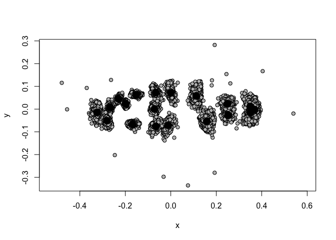
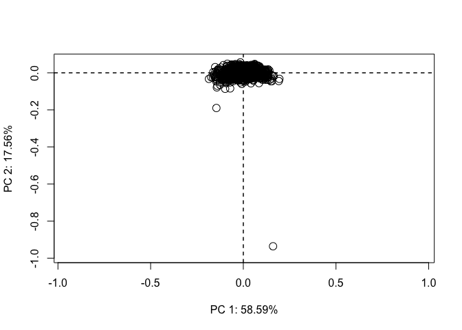
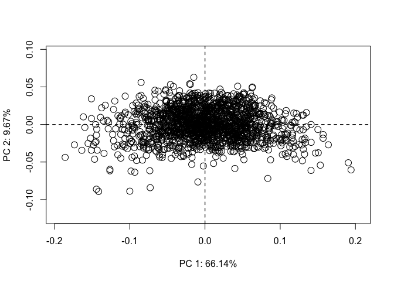
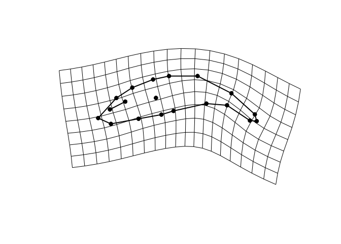
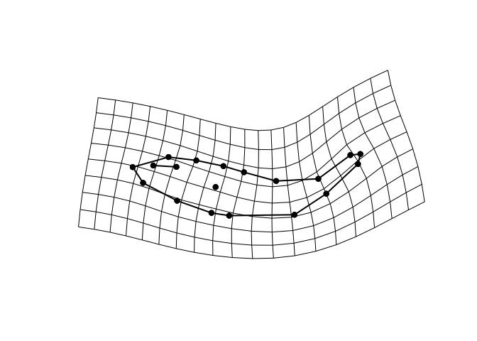
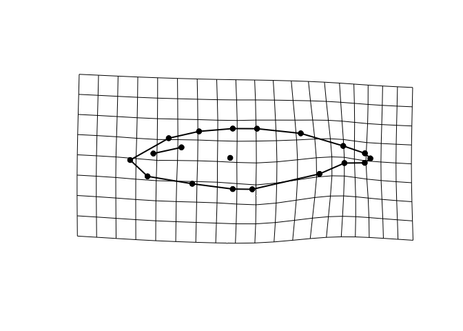
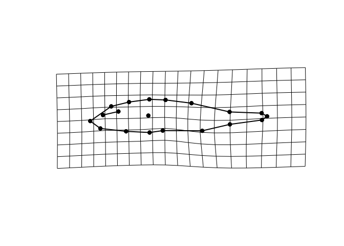
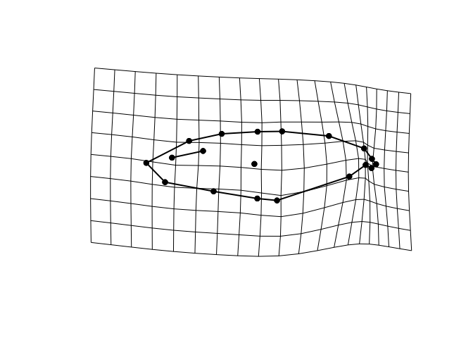
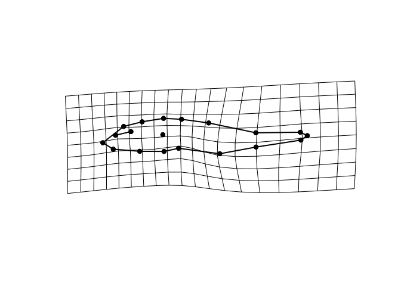

Size correcting landmarks and analysis for R geomorph
================

This bit of code will read your landmark file into R, label and order the landmarks into the format geomorph needs, calculate the correction factor based the size standard from phenopype, and perform the size correction.

This first bit of code will load the necessary libraries and set the working directory to the folder where this notebook is saved.

``` r
rm(list=ls())

library(geomorph)
library(stringr)
library(dplyr)
library(ggplot2)
library(readr)
library(ggpattern)
library(ggpubr)
library(car)
library(ggrepel)
```

We can then load in our landmark coordinates

``` r
#import uncorrected (size) landmarks
tmp <- read.csv("GL19_Closed_Coord_Full.csv", header=T)

tmp  <-   tmp %>% 
     filter(Quality == "p") %>% 
        na.omit


names <- tmp[,1] #create an object ("names") with sample names and info from column 1 of the imported data sheet
```

Adjust these next variables to suit your landmarking scheme. In the example data set, there are a total of 25 landmarks on each image.

``` r
NumLandmarks = 25
```

We then pull the appropriate columns (X or Y coordinates) into separate X and Y data frames for numbering the landmarks.

``` r
x<-tmp[,6:30]
y<-tmp[,31:55]
```

This bit of code creates a numbered list of X and Y values corresponding to the total number of landmarks indicated in the 'NumLandmarks' variable, from 1 to 25 in this case, and then adds those values to the X and Y coordinate data frames created above.

``` r
prefix_x <- c(paste("0", seq(1:9), sep = ""), seq(from = 10, to = NumLandmarks))
suffix_x <- "_X"

my.names_x <- paste(prefix_x, suffix_x, sep = "")

colnames(x) <- my.names_x


prefix_y <- c(paste("0", seq(1:9), sep = ""), seq(from = 10, to = NumLandmarks))
suffix_y <- "_Y"

my.names_y <- paste(prefix_y, suffix_y, sep = "")

colnames(y) <- my.names_y

rownames(x) <- sub("X.", "", rownames(x))
rownames(y) <- sub("Y.", "", rownames(y))

x <- cbind(names,x)
y <- cbind(names,y)
```

We can then merge our separated, labeled X and Y coordinate data frames, and sort them (in ascending order) by the landmark number, resulting in a data frame that has each landmarks X and Y coordinates in order, e.g. 01\_X, 01\_Y, 02\_X, 02\_Y, ...

``` r
UnsortedCoords <- merge(x,y, by = 1)

LabeledCoords <- UnsortedCoords[ , order(names(UnsortedCoords))]

head(LabeledCoords)
```

    ##   01_X 01_Y 02_X 02_Y 03_X 03_Y 04_X 04_Y 05_X 05_Y 06_X 06_Y 07_X 07_Y 08_X
    ## 1 4411 3026 4234 3164 4204 3108 4222 2904 4108 2704 3951 2782 3792 2784 3757
    ## 2 4465 2491 4338 2622 4318 2581 4307 2437 4179 2281 4056 2365 3927 2393 3882
    ## 3 4852 2921 4607 3017 4601 2952 4570 2729 4412 2542 4246 2647 4076 2668 3980
    ## 4 4268 2736 4076 2872 4060 2821 4045 2645 3898 2465 3752 2584 3611 2614 3590
    ## 5 3775 2847 3568 3012 3544 2959 3522 2741 3352 2550 3185 2655 3010 2687 2990
    ## 6 4213 2540 4019 2772 3974 2706 3934 2464 3747 2270 3572 2393 3379 2441 3353
    ##   08_Y 09_X 09_Y 10_X 10_Y 11_X 11_Y 12_X 12_Y 13_X 13_Y 14_X 14_Y 15_X 15_Y
    ## 1 2569 3604 2519 3592 2633 3734 3078 3716 3129 3296 3120 3031 3082 3358 2772
    ## 2 2209 3751 2191 3751 2292 3954 2642 3925 2670 3524 2739 3303 2768 3584 2447
    ## 3 2456 3827 2431 3827 2546 4069 3003 4047 3076 3525 3090 3268 3057 3577 2710
    ## 4 2403 3415 2373 3413 2479 3602 2903 3619 2950 3220 2929 2957 2880 3221 2617
    ## 5 2470 2795 2425 2793 2556 3024 3046 3037 3103 2493 3129 2227 3075 2542 2741
    ## 6 2178 3149 2143 3151 2312 3403 2820 3423 2865 2809 2966 2592 2917 2899 2526
    ##   16_X 16_Y 17_X 17_Y 18_X 18_Y 19_X 19_Y 20_X 20_Y 21_X 21_Y 22_X 22_Y 23_X
    ## 1 3328 2474 3038 2449 2548 2435 2620 3104 2221 2907 1786 2699 1838 2500 1425
    ## 2 3503 2177 3235 2171 2772 2223 2914 2863 2559 2629 2236 2524 2240 2339 1848
    ## 3 3548 2402 3221 2391 2576 2479 2723 3077 2446 3050 1993 3024 1943 2780 1495
    ## 4 3236 2341 2955 2326 2492 2353 2522 2897 2297 2786 1858 2593 1948 2412 1552
    ## 5 2534 2413 2191 2420 1574 2446 1756 3084 1343 2986  854 2784  875 2541  442
    ## 6 2857 2125 2482 2151 1788 2214 2072 2967 1516 2854 1062 2655 1096 2390  592
    ##   23_Y 24_X 24_Y 25_X 25_Y  names
    ## 1 2459 1396 2581 1330 2498 185144
    ## 2 2391 1826 2492 1765 2438 185145
    ## 3 2984 1544 3114 1420 3080 185146
    ## 4 2295 1517 2410 1467 2315 185147
    ## 5 2494  423 2639  343 2540 185148
    ## 6 2429  568 2581  484 2489 185149

We take the distance (in pixels) from the size standard and write that information into a new column (NumPix) on our coordinate data frame.

``` r
NumPix <- tmp[c("FishEc","V2")]

LabeledCoords <- merge(NumPix,LabeledCoords,by.x = "FishEc",by.y = "names")
```

Using this distance (i.e. the number of pixels that equals X mm in each photograph), we can calculate a correction factor (cf) that we will multiply all of our landmarks by to ‘resize’ them to account for variation in distance between the camera and the specimen across photos. This is simply a constant value (10 here) divided by the number of pixels between our known distance (the size standard).

``` r
LabeledCoords$CorFact <- as.numeric(100/LabeledCoords$V2)
```

We then multiply all of our landmarks by this correction factor to size correct them.

``` r
#need to multiply all values by cor fact.
#subset new values into new matrix with sample names and use that as input for geomorph
size_corr_landmarks <- LabeledCoords[3:52] * LabeledCoords$CorFact
```

Here we are taking the row names from our previous data frame and binding them to our new, size corrected landmarks for each specimen. Then we create a vector containing that specimen ID information ('names') for later use and throw out unused landmarks (those that don't contain shape information).

``` r
names <- LabeledCoords[,1] #create an object ("names") with sample names and info from column 1


size_corr_landmarks <- cbind(names, size_corr_landmarks)


names(size_corr_landmarks)[1] <- "ID"


names <- size_corr_landmarks[,1] #create an object ("names") with sample names and info from column 1

#drop unused landmarks
size_corr_landmarks <- subset(size_corr_landmarks, select=-c(6:7,14:15,18:23,38:39))
```

Now we can load our size corrected landmarks into the R geomorph array format.

``` r
#size_corr_landmarks[,2:ncol(tmp)] is telling the "arrayspecs" function to that the landmark data starts at column 2  from the "size_corr_landmarks" dataframe and continues to the end of the dataframe
#the 19 here is the number of landmarks, 
#the 2 is the number of dimensions (Just X and Y for us) 
coords <- arrayspecs(size_corr_landmarks[,2:ncol(size_corr_landmarks)], 19, 2) 
```

We can add our specimen IDs to the coordinate array we just created using the 'names' vector from above.

``` r
dimnames(coords)[[3]] <- names 
```

Lastly, we can use Generalized Procrustes Analysis (GPA) to align our landmarks from the specimens (to adjust for landmark variation that is due to differences in the photograph angles or specimen position) and plot the aligned landmark coordinates to make sure we see a shape that resembles our landmarking data set. You should see the landmarks falling into the rough shape of your specimens in the created plot. If not, something probably went wrong with your column specification somewhere above. The average location for each landmark is a large black dot, and the smaller gray points represent the aligned data from all the specimens for each landmark.

``` r
GPA <- gpagen(coords, PrinAxes = T, Proj = T, ProcD = T)
```

    ## 
    ## Performing GPA
    ## 
      |                                                                            
      |                                                                      |   0%
      |                                                                            
      |==================                                                    |  25%
      |                                                                            
      |===================================                                   |  50%
      |                                                                            
      |====================================================                  |  75%
      |                                                                            
      |======================================================================| 100%
    ## 
    ## Making projections... Finished!

``` r
GPA$coords <- GPA$coords * -1


landmark_plot <- plot(GPA)
```



``` r
landmark_summary <- summary(GPA)
```

    ## 
    ## Call:
    ## gpagen(A = coords, PrinAxes = T, ProcD = T, Proj = T) 
    ## 
    ## 
    ## 
    ## Generalized Procrustes Analysis
    ## with Partial Procrustes Superimposition
    ## 
    ## 19 fixed landmarks
    ## 0 semilandmarks (sliders)
    ## 2-dimensional landmarks
    ## 3 GPA iterations to converge
    ## 
    ## 
    ## Consensus (mean) Configuration
    ## 
    ##                X             Y
    ## 1   0.3243132507  0.0145122215
    ## 2   0.2804573723  0.0509220200
    ## 3   0.2675841225 -0.0070815407
    ## 4   0.2302394126 -0.0451108170
    ## 5   0.1986036083 -0.0224427662
    ## 6   0.1533027310 -0.0631090406
    ## 7   0.1681028076  0.0663753865
    ## 8   0.0658290438  0.0753733514
    ## 9   0.0124382081  0.0712774197
    ## 10  0.0717831243 -0.0004907628
    ## 11  0.0664145423 -0.0726650258
    ## 12  0.0002025745 -0.0711057354
    ## 13 -0.1115685177 -0.0580948554
    ## 14 -0.1583534034  0.0533798034
    ## 15 -0.2517633148  0.0256744831
    ## 16 -0.2497235837 -0.0231949587
    ## 17 -0.3495067554 -0.0116588404
    ## 18 -0.3498109218  0.0154804080
    ## 19 -0.3685443013  0.0019592494

``` r
meanshape <- mshape(GPA$coords, na.action = 1) #save the mean shape for use later, we will see how variation along specific axes warps the mean shape
```

We can examine the variation in body shape among our samples using PCA. First we run a PCA on the aligned coordinates from above.

``` r
ShapePC <- gm.prcomp(GPA$coords, phy = NULL)
summary(ShapePC)
```

    ## 
    ## Ordination type: Principal Component Analysis 
    ## Centering by OLS mean
    ## Orthogonal projection of OLS residuals
    ## Number of observations: 1639 
    ## Number of vectors 34 
    ## 
    ## Importance of Components:
    ##                              Comp1        Comp2        Comp3        Comp4
    ## Eigenvalues            0.003103966 0.0009304367 0.0002968849 0.0002036184
    ## Proportion of Variance 0.585919725 0.1756337294 0.0560414255 0.0384359893
    ## Cumulative Proportion  0.585919725 0.7615534542 0.8175948797 0.8560308690
    ##                              Comp5        Comp6        Comp7        Comp8
    ## Eigenvalues            0.000136338 0.0001005195 8.371663e-05 7.778516e-05
    ## Proportion of Variance 0.025735822 0.0189745528 1.580276e-02 1.468310e-02
    ## Cumulative Proportion  0.881766691 0.9007412440 9.165440e-01 9.312271e-01
    ##                               Comp9       Comp10       Comp11       Comp12
    ## Eigenvalues            4.901328e-05 0.0000415851 3.521818e-05 2.775418e-05
    ## Proportion of Variance 9.251983e-03 0.0078498041 6.647954e-03 5.239014e-03
    ## Cumulative Proportion  9.404791e-01 0.9483288915 9.549768e-01 9.602159e-01
    ##                              Comp13       Comp14       Comp15       Comp16
    ## Eigenvalues            0.0000250535 2.191956e-05 2.003603e-05 0.0000165833
    ## Proportion of Variance 0.0047292200 4.137642e-03 3.782099e-03 0.0031303442
    ## Cumulative Proportion  0.9649450796 9.690827e-01 9.728648e-01 0.9759951646
    ##                              Comp17       Comp18       Comp19       Comp20
    ## Eigenvalues            1.432726e-05 1.227212e-05 1.177539e-05 1.026193e-05
    ## Proportion of Variance 2.704483e-03 2.316544e-03 2.222779e-03 1.937092e-03
    ## Cumulative Proportion  9.786996e-01 9.810162e-01 9.832390e-01 9.851761e-01
    ##                              Comp21       Comp22       Comp23       Comp24
    ## Eigenvalues            1.019324e-05 9.487097e-06 7.988599e-06 7.918317e-06
    ## Proportion of Variance 1.924126e-03 1.790830e-03 1.507967e-03 1.494700e-03
    ## Cumulative Proportion  9.871002e-01 9.888910e-01 9.903990e-01 9.918937e-01
    ##                              Comp25       Comp26       Comp27       Comp28
    ## Eigenvalues            7.596639e-06 6.407192e-06 5.754825e-06 5.385823e-06
    ## Proportion of Variance 1.433978e-03 1.209453e-03 1.086309e-03 1.016654e-03
    ## Cumulative Proportion  9.933277e-01 9.945371e-01 9.956234e-01 9.966401e-01
    ##                              Comp29       Comp30       Comp31       Comp32
    ## Eigenvalues            4.354926e-06 3.841088e-06 3.371361e-06 2.354414e-06
    ## Proportion of Variance 8.220569e-04 7.250624e-04 6.363945e-04 4.444306e-04
    ## Cumulative Proportion  9.974621e-01 9.981872e-01 9.988236e-01 9.992680e-01
    ##                              Comp33       Comp34
    ## Eigenvalues            2.209110e-06 1.668609e-06
    ## Proportion of Variance 4.170022e-04 3.149748e-04
    ## Cumulative Proportion  9.996850e-01 1.000000e+00

``` r
ShapeCoordinates <- ShapePC$x
```

The line below creates a basic plot showing variation in body shape along the first two axes of variation from our PCA we can use this to see how our samples group.

``` r
plot(ShapePC, pch=21, cex = 1.5)
```



In the above plot we see a few clear outlier individuals on PC2, so we will drop them from the data set and re-run the PCA.

``` r
#drop outlier individuals driving shape variation based on their row number
omit <- c(1486,1490) 
coords.1 <- coords[,,-omit]

#re-run the General Procrustes Analysis on the reduced dataset
GPA <- gpagen(coords.1, PrinAxes = T, Proj = T, ProcD = T)
```

    ## 
    ## Performing GPA
    ## 
      |                                                                            
      |                                                                      |   0%
      |                                                                            
      |==================                                                    |  25%
      |                                                                            
      |===================================                                   |  50%
      |                                                                            
      |====================================================                  |  75%
      |                                                                            
      |======================================================================| 100%
    ## 
    ## Making projections... Finished!

``` r
GPA$coords <- GPA$coords * -1

#re-run PCA on the final set of specimens
ShapePC <- gm.prcomp(GPA$coords, phy = NULL)
summary(ShapePC)
```

    ## 
    ## Ordination type: Principal Component Analysis 
    ## Centering by OLS mean
    ## Orthogonal projection of OLS residuals
    ## Number of observations: 1637 
    ## Number of vectors 34 
    ## 
    ## Importance of Components:
    ##                              Comp1        Comp2        Comp3        Comp4
    ## Eigenvalues            0.003081605 0.0004503268 0.0002845492 0.0001663425
    ## Proportion of Variance 0.661421984 0.0966561287 0.0610743665 0.0357030184
    ## Cumulative Proportion  0.661421984 0.7580781131 0.8191524797 0.8548554981
    ##                               Comp5        Comp6        Comp7        Comp8
    ## Eigenvalues            0.0001261758 8.366386e-05 7.943977e-05 4.813401e-05
    ## Proportion of Variance 0.0270818198 1.795724e-02 1.705060e-02 1.033127e-02
    ## Cumulative Proportion  0.8819373179 8.998946e-01 9.169452e-01 9.272764e-01
    ##                               Comp9       Comp10       Comp11       Comp12
    ## Eigenvalues            4.460345e-05 3.530015e-05 2.963937e-05 2.686237e-05
    ## Proportion of Variance 9.573486e-03 7.576667e-03 6.361661e-03 5.765619e-03
    ## Cumulative Proportion  9.368499e-01 9.444266e-01 9.507882e-01 9.565539e-01
    ##                              Comp13       Comp14       Comp15       Comp16
    ## Eigenvalues            2.442576e-05 2.182612e-05 0.0000191374 1.622434e-05
    ## Proportion of Variance 5.242635e-03 4.684661e-03 0.0041075665 3.482319e-03
    ## Cumulative Proportion  9.617965e-01 9.664811e-01 0.9705887162 9.740710e-01
    ##                              Comp17       Comp18       Comp19       Comp20
    ## Eigenvalues            1.428588e-05 1.225593e-05 1.107743e-05 1.026806e-05
    ## Proportion of Variance 3.066257e-03 2.630559e-03 2.377611e-03 2.203890e-03
    ## Cumulative Proportion  9.771373e-01 9.797679e-01 9.821455e-01 9.843494e-01
    ##                              Comp21       Comp22       Comp23       Comp24
    ## Eigenvalues            9.421901e-06 9.052173e-06 7.965457e-06 7.778473e-06
    ## Proportion of Variance 2.022275e-03 1.942918e-03 1.709670e-03 1.669537e-03
    ## Cumulative Proportion  9.863716e-01 9.883145e-01 9.900242e-01 9.916938e-01
    ##                              Comp25       Comp26       Comp27       Comp28
    ## Eigenvalues            6.570132e-06 5.933615e-06 5.478878e-06 4.357774e-06
    ## Proportion of Variance 1.410184e-03 1.273565e-03 1.175962e-03 9.353330e-04
    ## Cumulative Proportion  9.931039e-01 9.943775e-01 9.955535e-01 9.964888e-01
    ##                              Comp29       Comp30       Comp31       Comp32
    ## Eigenvalues            3.931834e-06 3.509562e-06 3.375156e-06 2.315186e-06
    ## Proportion of Variance 8.439112e-04 7.532768e-04 7.244283e-04 4.969211e-04
    ## Cumulative Proportion  9.973327e-01 9.980860e-01 9.988104e-01 9.993073e-01
    ##                              Comp33       Comp34
    ## Eigenvalues            1.670504e-06 1.556676e-06
    ## Proportion of Variance 3.585494e-04 3.341181e-04
    ## Cumulative Proportion  9.996659e-01 1.000000e+00

``` r
ShapeCoordinates <- ShapePC$x

#save the PCA to a csv if needed
#write.csv(ShapeCoordinates, "GeomorphPCA.csv")

#The line below creates a basic plot showing variation in body shape along the first two axes of variation from our PCA
#we can use this to see how our samples group, in this plot we see a clear divide along PC1, which happens to be between the sexes for this example
plot(ShapePC, pch=21, cex = 1.5)
```



These next steps will help us to visualize variation along the first few PCs.

You can use the picknplot tool to click on any area of the shape space and create a visualization of what a specimen would like at that point, this is particularly useful for quickly looking at how shape varies along each axis or for looking at weird outlier individuals

``` r
#picknplot.shape(plot(ShapePC, pch=21, cex = 1.5))
```

Let's visualize variation along a specific axis, PC1.

``` r
PC.Scores <- as.data.frame(ShapePC$x)

PC <- PC.Scores$Comp1

#using the min and max values of data on the PC for visualization
predictor<- shape.predictor(GPA$coords, x = PC, Intercept = FALSE, method = c("LS"), pred1= min(PC), pred2=max(PC)) 

#this is a file telling R which landmarks should be connected by lines to visualize the outline of the fish
link <- read.csv("link.csv",header = 1)
links <- link[c(2:3)]

 

M <- mshape(GPA$coords)
plotRefToTarget(M, predictor$pred1, links = links)
```



``` r
plotRefToTarget(M, predictor$pred2, links = links)
```



Clearly the first PC is driven by the bending of specimens during storage. We can disregard this PC (as per [Paccard et al 2021](https://doi.org/10.1093/jhered/esz056), and focus on PC2 onward.

``` r
PC <- PC.Scores$Comp2

#using the min and max values of data on the PC for visualization
predictor<- shape.predictor(GPA$coords, x = PC, Intercept = FALSE, method = c("LS"), pred1= min(PC), pred2=max(PC)) 

#this is a file telling R which landmarks should be connected by lines to visualize the outline of the fish
link <- read.csv("link.csv",header = 1)
links <- link[c(2:3)]

 
plotRefToTarget(M, predictor$pred1, links = links)
```



``` r
plotRefToTarget(M, predictor$pred2, links = links)
```



Variation on PC2 looks more reasonable, something resembling benthic/limnetic type shape variation.

It's also possible to use values outside the actual data on the PC to exagerate differences for visualization if things are very subtle. Not needed in this case, but might be useful to know about. In this case it really highlights where the major changes in body shape occur on PC2: the caudaul peduncle and body depth.

``` r
predictor<- shape.predictor(GPA$coords, x = PC, Intercept = FALSE, method = c("LS"), pred1= (2*min(PC)), pred2=(2*max(PC)))

plotRefToTarget(M, predictor$pred1, links = links)
```



``` r
plotRefToTarget(M, predictor$pred2, links = links)
```



To see where specific populations fall out in this shape space we can take the PC scores and plot the points with more information in ggplot.

``` r
#Add sample info to PC scores
Sample_info <- read.csv("Fishec_Fish_2019.csv")
SampleInfo <- merge (Sample_info, PC.Scores, by.x = ("FishEc"), by.y = ("row.names"), all.y = TRUE)


#Add information about the lakes
LakeInfo <- read.csv("GL_Lake_Master.csv")
LakeInfo<-LakeInfo[(LakeInfo$Year=="2019"),] #data for sampling year
LakeInfo <- LakeInfo[, c(2,11,12,14)] #subset to relevant info
Final_Sample_Info <- merge(SampleInfo, LakeInfo, by.x = ("Site"), by.y = ("Lake"), all.x = TRUE)


summary(ShapePC)
```

    ## 
    ## Ordination type: Principal Component Analysis 
    ## Centering by OLS mean
    ## Orthogonal projection of OLS residuals
    ## Number of observations: 1637 
    ## Number of vectors 34 
    ## 
    ## Importance of Components:
    ##                              Comp1        Comp2        Comp3        Comp4
    ## Eigenvalues            0.003081605 0.0004503268 0.0002845492 0.0001663425
    ## Proportion of Variance 0.661421984 0.0966561287 0.0610743665 0.0357030184
    ## Cumulative Proportion  0.661421984 0.7580781131 0.8191524797 0.8548554981
    ##                               Comp5        Comp6        Comp7        Comp8
    ## Eigenvalues            0.0001261758 8.366386e-05 7.943977e-05 4.813401e-05
    ## Proportion of Variance 0.0270818198 1.795724e-02 1.705060e-02 1.033127e-02
    ## Cumulative Proportion  0.8819373179 8.998946e-01 9.169452e-01 9.272764e-01
    ##                               Comp9       Comp10       Comp11       Comp12
    ## Eigenvalues            4.460345e-05 3.530015e-05 2.963937e-05 2.686237e-05
    ## Proportion of Variance 9.573486e-03 7.576667e-03 6.361661e-03 5.765619e-03
    ## Cumulative Proportion  9.368499e-01 9.444266e-01 9.507882e-01 9.565539e-01
    ##                              Comp13       Comp14       Comp15       Comp16
    ## Eigenvalues            2.442576e-05 2.182612e-05 0.0000191374 1.622434e-05
    ## Proportion of Variance 5.242635e-03 4.684661e-03 0.0041075665 3.482319e-03
    ## Cumulative Proportion  9.617965e-01 9.664811e-01 0.9705887162 9.740710e-01
    ##                              Comp17       Comp18       Comp19       Comp20
    ## Eigenvalues            1.428588e-05 1.225593e-05 1.107743e-05 1.026806e-05
    ## Proportion of Variance 3.066257e-03 2.630559e-03 2.377611e-03 2.203890e-03
    ## Cumulative Proportion  9.771373e-01 9.797679e-01 9.821455e-01 9.843494e-01
    ##                              Comp21       Comp22       Comp23       Comp24
    ## Eigenvalues            9.421901e-06 9.052173e-06 7.965457e-06 7.778473e-06
    ## Proportion of Variance 2.022275e-03 1.942918e-03 1.709670e-03 1.669537e-03
    ## Cumulative Proportion  9.863716e-01 9.883145e-01 9.900242e-01 9.916938e-01
    ##                              Comp25       Comp26       Comp27       Comp28
    ## Eigenvalues            6.570132e-06 5.933615e-06 5.478878e-06 4.357774e-06
    ## Proportion of Variance 1.410184e-03 1.273565e-03 1.175962e-03 9.353330e-04
    ## Cumulative Proportion  9.931039e-01 9.943775e-01 9.955535e-01 9.964888e-01
    ##                              Comp29       Comp30       Comp31       Comp32
    ## Eigenvalues            3.931834e-06 3.509562e-06 3.375156e-06 2.315186e-06
    ## Proportion of Variance 8.439112e-04 7.532768e-04 7.244283e-04 4.969211e-04
    ## Cumulative Proportion  9.973327e-01 9.980860e-01 9.988104e-01 9.993073e-01
    ##                              Comp33       Comp34
    ## Eigenvalues            1.670504e-06 1.556676e-06
    ## Proportion of Variance 3.585494e-04 3.341181e-04
    ## Cumulative Proportion  9.996659e-01 1.000000e+00

``` r
#calculate percent variance explained by each axis
PoV <- ShapePC$sdev^2/sum(ShapePC$sdev^2)


#Calculate population means and standard deviations
gd1 <- Final_Sample_Info %>% 
  dplyr::group_by(Site) %>% # Group the data by sample site
  dplyr::summarize(mean_Comp1=mean(Comp1), # Create variable with mean of PC per group
                   mean_Comp2=mean(Comp2),
                   mean_Comp3=mean(Comp3),
                   mean_Comp4=mean(Comp4),
                   sd_Comp.1=sd(Comp1), # Create variable with sd of PC per group
                   sd_Comp.2=sd(Comp2),
                   sd_Comp.3=sd(Comp3),
                   sd_Comp.4=sd(Comp4),
                   N_PC=n(), # Create new variable N of PC per group
                   se1=sd_Comp.1/sqrt(N_PC), # Create variable with se of PC per group
                   se2=sd_Comp.2/sqrt(N_PC), 
                   se3=sd_Comp.3/sqrt(N_PC),
                   se4=sd_Comp.4/sqrt(N_PC),
                   upper_limit1=mean_Comp1+se1, # Upper limit
                   lower_limit1=mean_Comp1-se1, # Lower limit
                   upper_limit2=mean_Comp2+se2, # Upper limit
                   lower_limit2=mean_Comp2-se2, # Lower limit
                   upper_limit3=mean_Comp3+se3, # Upper limit
                   lower_limit3=mean_Comp3-se3, # Lower limit
                   upper_limit4=mean_Comp4+se4, # Upper limit
                   lower_limit4=mean_Comp4-se4 # Lower limit
  ) 

gd1   <- merge(LakeInfo, gd1, by.x = ("Lake"), by.y = ("Site"), all.y = TRUE)

#rename calculated mean columns
colnames(gd1)[5] <- "PC1"
colnames(gd1)[6] <- "PC2"
colnames(gd1)[7] <- "PC3"
colnames(gd1)[8] <- "PC4"


#make the plot for PC2 vs PC3
b <- ggplot(data=gd1, aes(PC2, PC3)) + 
  geom_errorbar(data=gd1, aes(ymin=lower_limit3, ymax=upper_limit3,width=0.001)) +
  geom_errorbarh(data=gd1, aes(xmin = lower_limit2,xmax = upper_limit2, height=0.001)) +
  geom_point(data=gd1, aes(PC2, PC3, shape=Fish, color=Fish, size = Areaha)) + theme_pubr() +
  geom_text_repel(data = gd1, aes(label=Lake)) +
  xlab(paste0("PC2 (", round((100*PoV[2]),2), "%)")) + 
  ylab(paste0("PC3 (", round((100*PoV[3]),2), "%)"))

b
```

    ## Warning: Removed 1 rows containing missing values (geom_errorbarh).

    ## Warning: Removed 2 rows containing missing values (geom_point).

    ## Warning: Removed 1 rows containing missing values (geom_text_repel).


